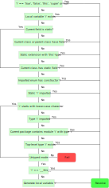

<!--label:types-->
# 型別

Haxe 編譯器採用豐富的型別系統，其有助於在編譯時檢測程式中與型別相關的錯誤。型別錯誤是指對給定型別以無效操作的情況，例如嘗試除以一個字串、嘗試對數字欄位的存取或在呼叫一個函式時使用過多或過少的引數。

在某些語言中，這種額外的安全性是有代價的，程式設計師不得不將型別顯式分配給語法結構：

```as3
var myButton:MySpecialButton = new MySpecialButton(); // As3
```

```cpp
MySpecialButton* myButton = new MySpecialButton(); // C++
```

在 Haxe 中則不需要顯式類型註釋，因為 Haxe 編譯器會推斷出型別：

```haxe
var myButton = new MySpecialButton(); // Haxe
```

我們將在稍後的[型別推斷](type-system-type-inference)中詳細探討 Haxe 的型別推斷。目前，只需要說明上述程式碼中的變數 `myButton` 是一個 `MySpecialButton` **類的實例**即可。

Haxe 型別系統可得知的七個觲別組：

- **類別實例**：給定了類別或介面的物件
- **列舉實例**：Haxe 列舉的值
- **結構**：匿名結構，即命名欄位的集合
- **函式**：可以接受一個或多個引數並且有回傳值的複合型別
- **動態**：與任何其他型別相容的萬用型別
- **抽象**：在執行期會由不同型別表示的編譯期型別
- **單態**：未知型別，在隨後可能會變為另一種型別。

我們將在隨後的章節中描述這些型別組以及它們之間的關係。

> #### 定義：複合型別
>
> 複合型別是具有子型別的型別，其包括任何具有[型別參數](type-system-type-parameters)與[函式](types-function)型別的型別。

<!--label:types-basic-types-->
## 基本型別

**基本型別**有 `Bool`、`Float` 和 `Int`，他們具有以下的值所以可以在語法中輕易識別：

- `Bool` 有 `true` 和 `false`
- `Int` 有類如 `1`、`0`、`-1` 和 `0xFF0000`
- `Float` 有類如 `1.0`、`0.0`、`-1.0` 和 `1e10`

基本類別在 Haxe 中並非類別，而是以抽象實作，並與編譯器的內部算子相繫結，如同下文所述。

<!--label:types-numeric-types-->
### 數字型別

> #### 定義：Float
>
> 表示雙精度的 IEEE 64 位浮點數。
<!---->
> #### 定義：Int
>
> 表示整型數。

雖然每個 `Int` 都可以在預期為 `Float` 的地方使用，也就是說，`Int` 可**分配為** `Float` 或者是與 `Float` **相統一**，但是事實並非如此：將 `Float` 分配為 `Int` 可能會導致精度損失，因此並不允許這樣的隱含轉換。

<!--label:types-overflow-->
### 溢出

出於效能原因，Haxe 編譯器不會強制檢查任何溢出行為，檢查溢出的負擔落在了目標平台上。以下是一些特定平台上溢出行為的註解：

- C++、Java、C#、Neko、Flash：與 32 位整型數有相同的溢出機理
- PHP、JS、Flash 8：沒有原生的 **Int** 型別，當數字達到浮點限制時會有精度損失。

作為替代，可以使用 **haxe.Int32** 與 **haxe.Int64** 類別來確保正確的溢出行為，但這在某些平台上需要以額外計算作為代價。

<!--label:types-bool-->
### Bool

> #### 定義：Bool
>
> 表示**真**或**假**的值。

`Bool` 型別的值在 `if` 和 `while` 等的條件式中很常見。

<!--label:types-void-->
### Void

> #### 定義：Void
>
> 表示沒有型別，其通常用於表示一些東西（通常是函式）沒有值。

`Void` 是型別系統中的一個特例，因為它事實上不是型別，這用於表示沒有型別，主要用於函式的引數和傳回值。

在一開始的 Hello World 例子中，我們已經見過 `Void`了：

<!--[code asset](assets/HelloWorld.hx)-->
```haxe
/**
    多行文檔註釋。
**/
class Main {
    static public function main():Void {
        // 單行註釋
        trace("Hello World");
    }
}
```

函式的型別將在[函式型別](types-function)部分中詳細探索，但快速預覽在此處有助益：在上面例子中的 `main` 函式的型別是 `Void->Void`，也就是「沒有引數也不回傳任何東西」。Haxe 不容許 `Void` 的欄位或變數，如果有此類聲明，會發生錯誤：

```haxe
// 不容許 Void 的引數和變數
var x:Void;
```

<!--label:types-nullability-->
#### 可空性

> #### 定義：可空
>
> 在 Haxe 中，如果 `null` 可以分配給一個型別，那這個型別就是可空的。

通常而言，程式語言會對可空性有單一清晰的定義。然而，由於 Haxe 目標語言的性質，Haxe 必在這方面取得妥協，雖然其中有一些語言容許並事實上對一切的默認值設為 `null`，但另一些卻甚至不容許某些型別有 `null` 值。因此，這需要區分兩種類型的目標語言：

> #### 定義：靜態目標
>
> 靜態目標使用自己的型別系統，對這些來說 `null` 不是基本型別的有效值。Flash、C++、Java與C#目標屬於此類。
<!---->
> #### 定義：動態目標
>
> 動態目標的型別系統更寬鬆，並容許基本型別使用 `null` 作為值。這適用於 JavaScript、PHP、Neko與 Flash 6-8 目標。

在動態目標上使用 `null` 時並沒有好擔心的，不過，對靜態目標則需要進一步考慮。首先，基本型別會初始化為它們的默認值。

> #### 定義：默認值
>
> 靜態目標的基本型別具有下列默認值：
>
> - `Int`：0
> - `Float`：在 Flash 上為 `NaN`，在其他靜態目標上則為 `0.0`
> - `Bool`：`false`

因此，Haxe編譯器並不容許將 `null` 分配至靜態目標上的基本型別。為了實現分配 `null` 值，基本型別必須首先包裝為 `Null<T>`：

```haxe
// 在靜態目標上錯誤
var a:Int = null;
var b:Null<Int> = null; // 容許
```

同樣，除非經過包裝，否則基本型別不能與 `null` 比較：

```haxe
var a:Int = 0;
// 在靜態目標上錯誤
if( a == null) { ... }
var b:Null<Int> = 0;
if( b != null) { ... } // 容許
```

此限制適用於一切執行 <!--TODO-->unification(type-system-unification) 的情況。

> #### 定義：`Null<T>`
>
> 在靜態目標上，可以使用 `Null<Int>`、`Null<Float>` 以及 `Null<Bool>` 來使之容許 `null` 作為值，這在動態目標上不會造成影響。`Null<T>` 也可以與其他型別一起使用以標記 `null` 是一個可接受的值。

如果 `Null<T>` 或 `Dynamic` 「隱含」有 `null` 值並分配給了基本型別，則受分配者會使用默認值：

```haxe
var n:Null<Int> = null;
var a:Int = n;
trace(a); //在靜態目標上為 0
```

<!--label:types-nullability-optional-arguments-->
### 可選引數與可空性

在考慮可空性時必須考慮可選引數，不可為空的**原生**可選引數與可能需要定義的特定於 Haxe 的可選引數之間的區分。這種區別通過使用問號可選引數實現：

```haxe
// x 是原生的 Int（不可為空）
function foo(x:Int = 0) {}
// y 是 Null<Int>（可為空）
function bar(?y:Int) {}
// z 也是 Null<Int>
function opt(?z:Int = -1) {}
```

> #### 瑣事：引數與參數
> 在一些其他程式語言中，**引數**（argument）與**參數**（parameter）是可混用的。而在 Haxe 中，對方法使用的是**引數**，而對[型別引數](type-system-type-parameters)則使用**參數**。

<!--label:types-class-instance-->
## 類別實例

與許多物件導向的程式設計語言相似，類別是 Haxe 中大多數程式中主要的資料結構。每一個 Haxe 類別有一個顯式的名稱、一個隱式的<!--TODO-->路徑以及若干類別欄位。在此處，我們將專注於類別的一般結構與其基本關係，同時將類別欄位的細節留給[類別欄位](class-field)。

以下的程式碼樣例是本節其餘部分的基礎：

```haxe
class Point {
    var x:Int;
    var y:Int;

    public function new(x, y) {
        this.x = x;
        this.y = y;
    }

    public function toString() {
        return "Point(" + x + "," + y + ")";
    }
}
```

從語意上說，該類別表示離散二為空間上的一個點，不過這不重要。相反，讓我們描述一下基本結構：

- 關鍵字 `class` 表明我們正在宣告一個類別。
- `Point` 是類別的名稱並且可以是符合[型別標識規則](define-identifier)的任何東西。
- 用花括號 `{}` 包裹著的是類別的欄位，
- 其由兩個變數欄位 `x` 和 `y` 組成，
- 接下來是一個名為 `new` 的特殊函數欄位，這是類別的構造器，
- 以及一個名為 `toString` 的通常函數。

Haxe 中有一種特殊型別與所有類別相容：

> #### 定義：`Class<T>`
>
> 該型別與所有類別型別相容，這意味著所有類別都可以分配給它。不過類別的實例不能分配給該類別。
>
> 在編譯時，`Class<T>` 是所有類別型別的共同基型別。這種關係不會反映在生成程式碼中。
>
> 當 API 要求**一個**類別而不是特定類別時，這種型別十分有用。這適用於 [[Haxe 反射 API]]中的幾個方法。

<!--label:types-class-constructor-->
### 類別構造器

類別實例是通過呼叫類別構造器建立的，這個過程通常稱作**實例化**。類別實例的另一個名稱是**物件**。儘管如此，我們更喜歡用術語類別實例來強調類別實例與[枚舉實例](types-enum-instance)的相似。

```haxe
var p = new Point(-1, 65);
```

上述程式碼將生成類別 `Point` 的實例，該實例分配給了名為 `p` 的變數。`Point`的構造器接收到了兩個引數 `x` 和 `y`（可在[類別實例](types-class-instance)比較其定義）。我們將在之後的 [new](expression-new) 部分重新審視 `new` 表達式的確切含意。目前，先將其視為呼叫類別構造器並返回了適合的物件。

<!--label:types-class-inheritance-->
### 衍生

類別可以用關鍵字 `extends` 宣告從其他類別衍生：

```haxe
class Point3 extends Point {
    var z:Int;

    public function new(x, y, z) {
        super(x, y);
        this.z = z;
    }
}
```

This relation is often described as "is-a": any instance of class `Point3` is also an instance of `Point`. `Point` is then known as the **parent class** of `Point3`, which is a **child class** of `Point`. A class may have many child classes, but only one parent class. The term "a parent class of class X" usually refers to its direct parent class, the parent class of its parent class and so on.

The code above is very similar to the original `Point` class, with two new constructs being shown:

 * `extends Point` denotes that this class inherits from class `Point`
* `super(x, y)` is the call to the constructor of the parent class, in this case, `Point.new`

It is not necessary for child classes to define their own constructors, but if they do, a call to `super()` is mandatory. Unlike some other object-oriented languages, this call can appear anywhere in the constructor code and does not have to be the first expression.

A class may override [methods](class-field-method) of its parent class, which requires the explicit `override` keyword. The effects and restrictions of this are detailed in [Overriding Methods](class-field-overriding).

##### since Haxe 4.0.0

Classes can be declared with the keyword `final` to prevent them from being extended.

> ##### Trivia: `:final` metadata
>
> Prior to Haxe 4, marking classes as final was possible using the `:final` metadata.


<!--label:types-interfaces-->
#### Interfaces

An interface can be understood as the signature of a class because it describes the public fields of a class. Interfaces do not provide implementations, but rather offer purely structural information:

```haxe
interface Printable {
	public function toString():String;
}
```
The syntax is similar to classes, with the following exceptions:

* The `interface` keyword is used instead of the `class` keyword.
* Functions do not have any [expressions](expression).
* Every field must have an explicit type.

Interfaces, unlike [structural subtyping](type-system-structural-subtyping), describe a **static relation** between classes. A given class is only considered to be compatible to an interface if it explicitly states as much:

```haxe
class Point implements Printable { }
```
Here, the `implements` keyword denotes that `Point` has an "is-a" relationship with `Printable`, i.e. each instance of `Point` is also an instance of `Printable`. While a class may only have one parent class, it may implement multiple interfaces through multiple `implements` keywords:

```haxe
class Point implements Printable
  implements Serializable
```

The compiler checks if the `implements` assumption holds. That is, it makes sure the class actually does implement all the fields required by the interface. A field is considered implemented if the class or any of its parent classes provide an implementation.

Interface fields are not limited to methods. They can be variables and properties as well:

[code asset](assets/InterfaceWithVariables.hx)

Interfaces can extend multiple other interfaces using the `extends` keyword:
```haxe
interface Debuggable extends Printable extends Serializable
```

##### since Haxe 4.0.0

Like classes, interfaces can be marked with the `final` keyword, preventing them from being extended.

> ##### Trivia: Implements Syntax
>
> Haxe versions prior to 3.0 required multiple `implements` keywords to be separated by a comma. We decided to adhere to the de-facto standard of Java and got rid of the comma. This was one of the breaking changes between Haxe 2 and 3.


<!--label:types-abstract-class-->
#### Abstract Class

##### since Haxe 4.2.0

Abstract classes (not to be confused with [Abstract](type-system-type-inference)) are classes with partial implementation. As such, an abstract class cannot be instantiated but must first be extended, with the child class either providing implementation of all abstract methods or being declared abstract itself.

In constrast to abstract classes, a class that implements all its methods is known as a concrete class. Concrete classes inheriting from abstract classes must be declared without the `abstract` keyword, and all abstract methods in the parent classes must be implemented.

Abstract classes support all language features that concrete classes support, thus any class can be declared abstract. Furthermore, abstract class methods behave similarly to interfaces; implementations of the methods do not use the `override` keyword.

```haxe
abstract class Vehicle {
  var speed:Float = 0;

  abstract public function getWheels():Int;

  public function new() {}
}

class Car extends Vehicle {
  public function getWheels() {
    return 4;
  }

  public function accelerate() {
    speed += 1;
  }
}

class Bike extends Vehicle {
  public function getWheels() {
    return 2;
  }

  public function accelerate() {
    speed += 2;
  }
}
```

An abstract class can be used to provide a partial implementation of an interface, leaving the implementation of other methods up to the child classes.

```haxe
interface Vehicle {
  public function getFuelType():String;
  public function getWheels():Int;
}

abstract class Bike implements Vehicle {
  public function getWheels():Int {
    return 2;
  }

  public function new() {}
}

class EBike extends Bike {
  public function getFuelType():String {
    return "electric";
  }
}
```


As with other inheritance relationships, child classes can be assigned to a type of their abstract parent class.

```haxe
abstract class Base {
  public abstract function say():String;

  public function new() {}
}

class Derived extends Base {
  public function say():String {
    return "Hello";
  }
}

class Main {
  public static function main() {
    var instance:Base = new Derived();
  }
}
```


A class can be declared abstract even if it has no abstract methods. Even in this case it cannot be instantiated, but non-abstract child classes can be.

```haxe
abstract class Spaceship {
  public function whatAmI():Void {
    trace("Spaceship");
  }

  public function new() {}
}

class Rocket extends Spaceship {}

class Main {
  public static function main() {
    // var spaceship = new Spaceship();  // Error: Spaceship is abstract and cannot be constructed
    var rocket = new Rocket(); // Succeed
  }
}
```

Even though they can't be instantiated, abstract classes can still have a constructor that the child class can call with `super()`.

```haxe
abstract class Parent {
  public function new() {
    trace("Parent created!");
  }
}

class Child extends Parent {
  public function new() {
    super();
    trace("Child created!");
  }
}
```


<!--label:types-enum-instance-->
### Enum Instance

Haxe provides powerful enumeration (short: enum) types, which are actually an **algebraic data type** (ADT). While they cannot have any [expressions](expression), they are very useful for describing data structures:

[code asset](assets/Color.hx)

Semantically, this enum describes a color which is either red, green, blue or a specified RGB value. The syntactic structure is as follows:

* The keyword `enum` denotes that we are declaring an enum.
* `Color` is the name of the enum and could be anything conforming to the rules for [type identifiers](define-identifier).
* Enclosed in curly braces `{}` are the **enum constructors**,
* which are `Red`, `Green`, and `Blue` taking no arguments,
* as well as `Rgb` taking three `Int` arguments named `r`, `g` and `b`.

The Haxe type system provides a type which unifies with all enum types:

> ##### Define: `Enum<T>`
>
> This type is compatible with all enum types. At compile-time, `Enum<T>` can be seen as the common base type of all enum types. However, this relation is not reflected in generated code.

<!--label:types-enum-constructor-->
#### Enum Constructor

Similar to classes and their constructors, enums can be instantiated using their constructors. However, unlike classes, enums provide multiple constructors which can accessed through their name:

```haxe
var a = Red;
var b = Green;
var c = Rgb(255, 255, 0);
```
In this code, the type of variables `a`, `b` and `c` is `Color`. Variable `c` is initialized using the `Rgb` constructor with arguments.

All enum instances can be assigned to a special type named `EnumValue`.

> ##### Define: EnumValue
>
> EnumValue is a special type which unifies with all enum instances. It is used by the [Haxe Standard Library](std) to provide certain operations for all enum instances and can be employed in user-code accordingly in cases where an API requires **an** enum instance, but not a specific one.

It is important to distinguish between enum types and enum constructors, as this example demonstrates:

[code asset](assets/EnumUnification.hx)

If the commented line is uncommented, the program does not compile because `Red` (an enum constructor) cannot be assigned to a variable of type `Enum<Color>` (an enum type). The relation is analogous to a class and its instance.

> ##### Trivia: Concrete type parameter for `Enum<T>`
>
> One of the reviewers of this manual was confused about the difference between `Color` and `Enum<Color>` in the example above. Indeed, using a concrete type parameter there is pointless and only serves the purpose of demonstration. Usually, we would omit the type there and let [type inference](type-system-type-inference) deal with it.
>
> However, the inferred type would be different from `Enum<Color>`. The compiler infers a pseudo-type which has the enum constructors as "fields". As of Haxe 3.2.0, it is not possible to express this type in syntax but also, it is never necessary to do so.


<!--label:types-enum-using-->
#### Using enums

Enums are a good choice if only a finite set of values should be allowed. The individual [constructors](types-enum-constructor) then represent the allowed variants and enable the compiler to check if all possible values are respected:

[code asset](assets/Color2.hx)

After retrieving the value of `color` by assigning the return value of `getColor()` to it, a [`switch` expression](expression-switch) is used to branch depending on the value. The first three cases, `Red`, `Green`, and `Blue`, are trivial and correspond to the constructors of `Color` that have no arguments. The final case, `Rgb(r, g, b)`, shows how the argument values of a constructor can be extracted; they are available as local variables within the case body expression, just as if a [`var` expression](expression-var) had been used.

Advanced information on using the `switch` expression will be explored later in the section on [pattern matching](lf-pattern-matching).


<!--label:types-anonymous-structure-->
### Anonymous Structure

Anonymous structures can be used to group data without explicitly creating a type. The following example creates a structure with two fields, `x` and `name`, and initializes their values to `12` and `"foo"` respectively:

[code asset](assets/Structure.hx)

The general syntactic rules are as follows:

1. A structure is enclosed in **curly braces** `{}` and
2. has a **comma-separated** list of key-value pairs.
3. A **colon** separates the key, which must be a valid [identifier](define-identifier), from the value.
4. The value can be any Haxe expression.

Rule 4 implies that structures can be nested and complex, e.g.:

```haxe
var user = {
  name : "Nicolas",
	age : 32,
	pos : [
	  { x : 0, y : 0 },
		{ x : 1, y : -1 }
  ],
};
```
Fields of structures, like classes, are accessed using a **dot** (`.`):

```haxe
// get value of name, which is "Nicolas"
user.name;
// set value of age to 33
user.age = 33;
```
It is worth noting that using anonymous structures does not subvert the typing system. The compiler ensures that only available fields are accessed, which means the following program does not compile:

```haxe
class Test {
  static public function main() {
    var point = { x: 0.0, y: 12.0 };
    // { y : Float, x : Float } has no field z
    point.z;
  }
}
```
The error message indicates that the compiler knows the type of `point`: it is a structure with fields `x` and `y` of type `Float`. Since it has no field `z`, the access fails.
The type of `point` is known through [type inference](type-system-type-inference), which thankfully saves us from using explicit types for local variables. If `point` was a field instead, explicit typing would be necessary:

```haxe
class Path {
    var start : { x : Int, y : Int };
    var target : { x : Int, y : Int };
    var current : { x : Int, y : Int };
}
```
To avoid this kind of redundant type declaration, especially for more complex structures, it is advised to use a [typedef](type-system-typedef):

```haxe
typedef Point = { x : Int, y : Int }

class Path {
    var start : Point;
    var target : Point;
    var current : Point;
}
```

You may also use [Extensions](types-structure-extensions) to "inherit" fields from other structures:

```haxe
typedef Point3 = { > Point, z : Int }
```

<!--label:types-structure-json-->
#### JSON for Structure Values

It is also possible to use **JavaScript Object Notation** for structures by using **string literals** for the keys:

```haxe
var point = { "x" : 1, "y" : -5 };
```
While any string literal is allowed, the field is only considered part of the type if it is a valid [Haxe identifier](define-identifier). Otherwise, Haxe syntax does not allow expressing access to such a field, and [reflection](std-reflection) has to be employed through the use of `Reflect.field` and `Reflect.setField` instead.


<!--label:types-structure-class-notation-->
#### Class Notation for Structure Types

When defining a structure type, Haxe allows the use of the same syntax described in [Class Fields](class-field). The following [typedef](type-system-typedef) declares a `Point` type with variable fields `x` and `y` of type `Int`:

```haxe
typedef Point = {
    var x : Int;
    var y : Int;
}
```

##### since Haxe 4.0.0

The fields of a structure may also be declared with `final`, which only allows them to be assigned once. Such a structure will only [unify](type-system-unification) with other types if the corresponding fields are also `final`.


<!--label:types-structure-optional-fields-->
#### Optional Fields

Fields of a structure type can be made optional. In the standard notation, this is achieved by prefixing the field name with a question mark `?`:

```haxe
typedef User = {
  age : Int,
  name : String,
  ?phoneNumber : String
}
```

In class notation, the `@:optional` metadata can be used instead:

```haxe
typedef User = {
  var age : Int;
  var name : String;
  @:optional var phoneNumber : String;
}
```

##### since Haxe 4.0.0

A structure field can be declared as optional in the **class notation** by prefixing its name with a question mark `?`:

```haxe
typedef User = {
  var age : Int;
  var name : String;
  var ?phoneNumber : String;
}
```


<!--label:types-structure-performance-->
#### Impact on Performance

Using structures and, by extension, [structural subtyping](type-system-structural-subtyping), has no impact on performance when compiling to [dynamic targets](define-dynamic-target). However, on [static targets](define-static-target) access is typically slower. While some of them (JVM, HL) optimize common cases, the worst case requires a dynamic lookup which can be orders of magnitude slower than class field access.

<!--label:types-structure-extensions-->
#### Extensions

Extensions are used to express that a structure has all the fields of a given type as well as some additional fields of its own:

[code asset](assets/Extension.hx)

The greater-than operator `>` denotes that an extension of `Iterable<T>` is being created, with the additional class fields following. In this case, a read-only [property](class-field-property) `length` of type `Int` is required.

In order to be compatible with `IterableWithLength<T>`, a type must be compatible with `Iterable<T>` and provide a read-only `length` property of type `Int`. The previous example assigns an `Array`, which happens to fulfill these requirements.

##### since Haxe 3.1.0

Multiple structures can be extended at once:

[code asset](assets/Extension2.hx)

##### since Haxe 4.0.0

An alternative notation for extension can be used, denoted by separating each extended structure with an `&` symbol.

[code asset](assets/Extension3.hx)


<!--label:types-function-->
### Function Type

The function type, along with the [monomorph](types-monomorph), is a type which is usually well-hidden from Haxe users, yet present everywhere. We can make it surface by using `$type`, a special Haxe identifier which outputs the type its expression has during compilation:

[code asset](assets/FunctionType.hx)

There is a strong resemblance between the declaration of function `test` and the output of the first `$type` expression, with one subtle difference: the **function return type** appears at the end after a `->` symbol.

In either notation, it is obvious that the function `test` accepts one argument of type `Int` and one argument of type `String` and returns a value of type `Bool`. If a call to this function, such as `test(1, "foo")`, is made within the second `$type` expression, the Haxe typer checks if `1` can be assigned to `Int` and if `"foo"` can be assigned to `String`. The type of the call is then equal to the type of the value `test` returns, which is `Bool`.

Note that argument names are optional in the function type. If a function type has other function types as arguments or return types, parentheses can be used to group them correctly. For example, `(Int, ((Int) -> Void)) -> Void` represents a function which has one argument of type `Int` and one argument of function type `Int -> Void` and a return type `Void`.

The type of a function which takes no arguments uses `()` to represent the argument list:

[code asset](assets/FunctionType2.hx)


##### Old function type notation

Before Haxe 4, the function type notation had more in common with other functional programming languages, using `->` in place of commas separating the argument types. The `test` function above would be typed as `Int -> String -> Bool` in this notation. `test2` would be typed as `Void -> Bool`.

The older notation is still supported, although newer code should use the new notation described above since it more clearly differentiates argument types from the return type.

> ##### Trivia: New function type notation
>
> The new function type notation was based on the syntax of [arrow functions](expression-arrow-function), which were also introduced in Haxe 4.

<!--label:types-function-optional-arguments-->
#### Optional Arguments

Optional arguments are declared by prefixing an argument identifier with a question mark `?`:

[code asset](assets/OptionalArguments.hx)

Function `test` has two optional arguments: `i` of type `Int` and `s` of `String`. This is directly reflected in the function type output by line 4.
This example program calls `test` four times and prints its return value.

1. The first call is made without any arguments.
2. The second call is made with a singular argument `1`.
3. The third call is made with two arguments `1` and `"foo"`.
4. The fourth call is made with a singular argument `"foo"`.

The output shows that optional arguments which are omitted from the call have a value of `null`. This implies that the type of these arguments must admit `null` as value, which raises the question of its [nullability](types-nullability). The Haxe Compiler ensures that optional basic type arguments are nullable by inferring their type as `Null<T>` when compiling to a [static target](define-static-target).

While the first three calls are intuitive, the fourth one might come as a surprise; optional arguments can be skipped if the supplied value is assignable to a later argument.


<!--label:types-function-default-values-->
#### Default values

Haxe allows default values for arguments by assigning a **constant value** to them:

[code asset](assets/DefaultValues.hx)

This example is very similar to the example from [Optional Arguments](types-function-optional-arguments), with the only difference being that the values `12` and `"bar"` are assigned to the function arguments `i` and `s` respectively. The effect is that the default values are used instead of `null`, should an argument be omitted from the call.

Default values in Haxe are not part of the type and are not replaced at the call-site unless the function is [inlined](class-field-inline). On some targets the compiler may still pass `null` for omitted argument values and generate code similar to this inside the function:
```haxe
	static function test(i = 12, s = "bar") {
		if (i == null) i = 12;
		if (s == null) s = "bar";
		return "i: " +i + ", s: " +s;
	}
```
This should be considered in performance-critical code where a solution without default values may sometimes be more viable.


<!--label:types-dynamic-->
### Dynamic

While Haxe has a static type system, it can essentially be disabled by using the `Dynamic` type. A **dynamic value** can be assigned to anything and anything can be assigned to it. This has several drawbacks:

* The compiler can no longer type-check assignments, function calls and other constructs where specific types are expected.
* Certain optimizations, in particular when compiling to static targets, can no longer be employed.
* Some common errors such as typos in field accesses cannot be caught at compile-time and likely cause errors at runtime.
* [Dead Code Elimination](cr-dce) cannot detect used fields if they are used through `Dynamic`.

It is very easy to come up with examples where the usage of `Dynamic` can cause problems at runtime. Consider compiling the following two lines to a static target:

```haxe
var d:Dynamic = 1;
d.foo;
```

Trying to run a compiled program in the Flash Player yields an error `Property foo not found on Number and there is no default value`. Without `Dynamic`, this would have been detected at compile-time.

Use of `Dynamic` should be minimized as there are often better options available. However, it is occasionally the practical solution; parts of the Haxe [Reflection](std-reflection) API make use of it. Additionally, using `Dynamic` can be the best choice to handle custom data structures that are not known at compile-time.

`Dynamic` behaves in a special way when being [unified](type-system-unification) with a [monomorph](types-monomorph). Monomorphs are never bound to `Dynamic` which can have surprising results in examples such as this:

[code asset](assets/DynamicInferenceIssue.hx)

Although the return type of `Json.parse` is `Dynamic`, the type of local variable `json` is not bound to it and remains a monomorph. It is then inferred as an [anonymous structure](types-anonymous-structure) upon the `json.length` field access, which causes the following `json[0]` array access to fail. In order to avoid this, the variable `json` can be explicitly typed as `Dynamic` by using `var json:Dynamic`.

> ##### Trivia: Dynamic Inference before Haxe 3
>
> The Haxe 3 compiler never infers a type to `Dynamic`, so users must be explicit about it. Previous Haxe versions used to infer arrays of mixed types, e.g. `[1, true, "foo"]`, as `Array<Dynamic>`. We found that this behavior introduced too many type problems and thus removed it for Haxe 3.

> ##### Trivia: Dynamic in the Standard Library
>
> Dynamic was quite frequent in the Haxe Standard Library before Haxe 3. With the continuous improvements of the Haxe type system, the occurrences of Dynamic were reduced over the releases leading to Haxe 3.

<!--label:types-dynamic-with-type-parameter-->
#### Dynamic with Type Parameter

`Dynamic` is a special type because it allows explicit declaration with and without a [type parameter](type-system-type-parameters). If such a type parameter is provided, the semantics described in [Dynamic](types-dynamic) are constrained to all fields being compatible with the parameter type:

```haxe
var att : Dynamic<String> = xml.attributes;
// valid, value is a String
att.name = "Nicolas";
// dito (this documentation is quite old)
att.age = "26";
// error, value is not a String
att.income = 0;
```


<!--label:types-dynamic-access-->
#### Dynamic access

`DynamicAccess` is an [abstract type](types-abstract) for working with [anonymous structures](types-anonymous-structure) that are intended to hold collections of objects by the string key. Basically, `DynamicAccess` wraps [`Reflect`](std-reflection) calls in a Map-like interface.

[code asset](assets/DynamicAccess.hx)


<!--label:types-dynamic-any-->
#### Any type

`Any` is a type that is compatible with any other type in both directions.
It serves one purpose - to hold values of any type. Explicit casting is required to use these values in order to guarantee that the code does not suddenly become dynamically typed. This restriction maintains Haxe's static typing, and allows for the continued use of advanced type system features and optimizations associated with the type system.

The implementation is quite simple:

```haxe
abstract Any(Dynamic) from Dynamic to Dynamic {}
```

The 'Any' type does not make assumptions about what the value actually is or whether it supports fields or operations - this is up to the user to handle.

[code asset](assets/Any.hx)

`Any` is a more type-safe alternative to `Dynamic` because it doesn't support field access or operators and is bound to monomorphs. To work with the actual value, it needs to be explicitly promoted to another type.


<!--label:types-abstract-->
### Abstract

An abstract type is a type which is actually a different type at run-time. It is a compile-time feature which defines types "over" concrete types in order to modify or augment their behavior:

[code asset](assets/MyAbstract.hx#L1-L5)

We can derive the following from this example:

* The keyword `abstract` denotes that we are declaring an abstract type.
* `AbstractInt` is the name of the abstract type and could be anything conforming to the rules for type identifiers.
* The **underlying type** `Int` is enclosed in parentheses `()`.
* The fields are enclosed in curly braces `{}`,
* which are a constructor function `new` accepting one argument `i` of type `Int`.

> ##### Define: Underlying Type
>
> The underlying type of an abstract is the type which is used to represent said abstract at runtime. It is usually a concrete (i.e. non-abstract) type but could be another abstract type as well.

The syntax is reminiscent of classes and the semantics are indeed similar. In fact, everything in the "body" of an abstract (everything after the opening curly brace) is parsed as class fields. Abstracts may have [method](class-field-method) fields and non-[physical](define-physical-field) [property](class-field-property) fields.

Furthermore, abstracts can be instantiated and used just like classes:

[code asset](assets/MyAbstract.hx#L7-L12)

As mentioned before, abstracts are a compile-time feature, so it is interesting to see what the above actually generates. A suitable target for this is JavaScript, which tends to generate concise and clean code. Compiling the above using `haxe --main MyAbstract --js myabstract.js` shows this JavaScript code:

```js
var a = 12;
console.log(a);
```
The abstract type `Abstract` completely disappeared from the output and all that is left is a value of its underlying type, `Int`. This is because the constructor of `Abstract` is inlined - something we shall learn about later in the section [Inline](class-field-inline) - and its inlined expression assigns a value to `this`. This might be surprising when thinking in terms of classes. However, it is precisely what we want to express in the context of abstracts. Any **inlined member method** of an abstract can assign to `this` and thus modify the "internal value".

One problem may be apparent - what happens if a member function is not declared inline? The code obviously must be placed somewhere! Haxe handles this by creating a private class, known as the **implementation class**, which contains all the abstract member functions as static functions accepting an additional first argument `this` of the underlying type.

> ##### Trivia: Basic Types and abstracts
>
> Before the advent of abstract types, all basic types were implemented as extern classes or enums. While this nicely took care of some aspects such as `Int` being a "child class" of `Float`, it caused issues elsewhere. For instance, with `Float` being an extern class, it would unify with the empty structure `{}`, making it impossible to constrain a type to accept only real objects.

<!--label:types-abstract-implicit-casts-->
#### Implicit Casts

Unlike classes, abstracts allow defining implicit casts. There are two kinds of implicit casts:

* Direct: Allows direct casting of the abstract type to or from another type. This is defined by adding `to` and `from` rules to the abstract type and is only allowed for types which unify with the underlying type of the abstract.
* Class field: Allows casting via calls to special cast functions. These functions are defined using `@:to` and `@:from` metadata. This kind of cast is allowed for all types.

The following code example shows an example of **direct** casting:

[code asset](assets/ImplicitCastDirect.hx)

We declare `MyAbstract` as being `from Int` and `to Int`, appropriately meaning it can be assigned from `Int` and assigned to `Int`. This is shown in lines 9 and 10, where we first assign the `Int` `12` to variable `a` of type `MyAbstract` (this works due to the `from Int` declaration) and then that abstract back to variable `b` of type `Int` (this works due to the `to Int` declaration).

Class field casts have the same semantics, but are defined completely differently:

[code asset](assets/ImplicitCastField.hx)

By adding `@:from` to a static function, that function qualifies as an implicit cast function from its argument type to the abstract. These functions must return a value of the abstract type. They must also be declared `static`.

Similarly, adding `@:to` to a function qualifies it as implicit cast function from the abstract to its return type.

In the previous example, the method `fromString` allows the assignment of value `"3"` to variable `a` of type `MyAbstract` while the method `toArray` allows assigning that abstract to variable `b` of type `Array<Int>`.

When using this kind of cast, calls to the cast functions are inserted where required. This becomes obvious when looking at the JavaScript output:

```js
var a = _ImplicitCastField.MyAbstract_Impl_.fromString("3");
var b = _ImplicitCastField.MyAbstract_Impl_.toArray(a);
```
This can be further optimized by [inlining](class-field-inline) both cast functions, turning the output into the following:

```haxe
var a = Std.parseInt("3");
var b = [a];
```
The **selection algorithm** when assigning a type `A` to a type `B` where at least one is an abstract is simple:

1. If `A` is not an abstract, go to 3.
2. If `A` defines a **to**-conversion that admits `B`, go to 6.
3. If `B` is not an abstract, go to 5.
4. If `B` defines a **from**-conversion that admits `A`, go to 6.
5. Stop, unification fails.
6. Stop, unification succeeds.



_Figure: Selection algorithm flow chart._

By design, implicit casts are **not transitive**, as the following example shows:

[code asset](assets/ImplicitTransitiveCast.hx)

While the individual casts from `A` to `B` and from `B` to `C` are allowed, a transitive cast from `A` to `C` is not. This is to avoid ambiguous cast paths and retain a simple selection algorithm.


<!--label:types-abstract-operator-overloading-->
#### Operator Overloading

Abstracts allow overloading of unary and binary operators by adding the `@:op` metadata to class fields:

[code asset](assets/AbstractOperatorOverload.hx)

By defining `@:op(A * B)`, the function `repeat` serves as the operator method for the multiplication `*` operator when the type of the left value is `MyAbstract` and the type of the right value is `Int`. The usage is shown in line 17, which turns into the following code when compiled to JavaScript:

```js
console.log(_AbstractOperatorOverload.
  MyAbstract_Impl_.repeat(a,3));
```
Similar to [implicit casts with class fields](types-abstract-implicit-casts), a call to the overload method is inserted where required.

The example `repeat` function is not commutative: while `MyAbstract * Int` works, `Int * MyAbstract` does not. The `@:commutative` metadata can be attached to the function to force it to accept the types in either order.

If the function should work **only** for `Int * MyAbstract`, but not for `MyAbstract * Int`, the overload method can be made static, accepting `Int` and `MyAbstract` as the first and second types respectively.

Overloading unary operators is similar:

[code asset](assets/AbstractUnopOverload.hx)

Both binary and unary operator overloads can return any type.

##### since Haxe 4.0.0

The `@:op` syntax can be used to overload field access and array access on abstracts:

* `@:op([])` on a function with one argument overloads array read access.
* `@:op([])` on a function with two arguments overloads array write access, with the first argument being the index and the second one being the written value.
* `@:op(a.b)` on a function with one argument overloads field read access.
* `@:op(a.b)` on a function with two arguments overloads field write access.

[code asset](assets/AbstractAccessOverload.hx)

##### Exposing underlying type operations

The method body of an `@:op` function can be omitted, but only if the underlying type of the abstract allows the operation in question and the resulting type can be assigned back to the abstract.

[code asset](assets/AbstractExposeTypeOperations.hx)


<!--label:types-abstract-array-access-->
#### Array Access

Array access describes the particular syntax traditionally used to access a value in an array at a certain offset. This is usually only allowed with arguments of type `Int`. Using abstracts, however, makes it possible to define custom array access methods. The [Haxe Standard Library](std) uses this in its `Map` type, where the following two methods can be found:

```haxe
@:arrayAccess
public inline function get(key:K) {
  return this.get(key);
}
@:arrayAccess
public inline function arrayWrite(k:K, v:V):V {
	this.set(k, v);
	return v;
}
```
There are two kinds of array access methods:

* If an `@:arrayAccess` method accepts one argument, it is a getter.
* If an `@:arrayAccess` method accepts two arguments, it is a setter.

The methods `get` and `arrayWrite` seen above then allow for the following usage:

[code asset](assets/AbstractArrayAccess.hx)

At this point, it should not be surprising to see that calls to the array access fields are inserted into the output:

```js
map.set("foo",1);
console.log(map.get("foo")); // 1
```

##### Order of array access resolving

Due to a bug in Haxe versions before 3.2, the order of checked `@:arrayAccess` fields was undefined. This was fixed for Haxe 3.2 so that the fields are now consistently checked from top to bottom:

[code asset](assets/AbstractArrayAccessOrder.hx)

The array access `a[0]` is resolved to the `getInt1` field, leading to the lower case `f` being returned. The result might be different in Haxe versions before 3.2.

Fields which are defined earlier take priority even if they require an [implicit cast](types-abstract-implicit-casts).


<!--label:types-abstract-enum-->
#### Enum abstracts

##### since Haxe 3.1.0

By adding the `@:enum` metadata to an abstract definition, that abstract can be used to define finite value sets:

[code asset](assets/AbstractEnum.hx)

The Haxe Compiler replaces all field access to the `HttpStatus` abstract with their values, as evident in the JavaScript output:

```js
Main.main = function() {
	var status = 404;
	var msg = Main.printStatus(status);
};
Main.printStatus = function(status) {
	switch(status) {
	case 404:
		return "Not found";
	case 405:
		return "Method not allowed";
	}
};
```

This is similar to accessing [variables declared as inline](class-field-inline), but has several advantages:

* The typer can ensure that all values of the set are typed correctly.
* The pattern matcher checks for [exhaustiveness](lf-pattern-matching-exhaustiveness) when [matching](lf-pattern-matching) an enum abstract.
* Defining fields requires less syntax.

##### since Haxe 4.0.0

Enum abstracts can be declared without using the `@:enum` metadata, instead using the more natural syntax `enum abstract`. Additionally, if the underlying type is `String` or `Int`, the values for the enum cases can be omitted and are deduced by the compiler:

* For `Int` abstracts, the deduced values increment the last user-defined value or start at zero if no value was declared yet.
* For `String` abstracts, the deduced value is the identifier of the enum case.

[code asset](assets/AbstractEnum2.hx)


<!--label:types-abstract-forward-->
#### Forwarding abstract fields

##### since Haxe 3.1.0

When wrapping an underlying type, it is sometimes desirable to "keep" parts of its functionality. Because writing forwarding functions by hand is cumbersome, Haxe allows adding the `@:forward` metadata to an abstract type:

[code asset](assets/AbstractExpose.hx)

The `MyArray` abstract in this example wraps `Array`. Its `@:forward` metadata has two arguments which correspond to the field names to be forwarded to the underlying type. In this example, the `main` method instantiates `MyArray` and accesses its `push` and `pop` methods. The commented line demonstrates that the `length` field is not available.

As usual, we can look at the JavaScript output to see how the code is being generated:

```js
Main.main = function() {
	var myArray = [];
	myArray.push(12);
	myArray.pop();
};
```

`@:forward` can be utilized without any arguments in order to forward all fields. Of course, the Haxe Compiler still ensures that the field actually exists on the underlying type.

> ##### Trivia: Implemented as macro
>
> Both the `@:enum` and `@:forward` functionality were originally implemented using [build macros](macro-type-building). While this worked nicely in non-macro code, it caused issues if these features were used from within macros. The implementation was subsequently moved to the compiler.


<!--label:types-abstract-core-type-->
#### Core-type abstracts

The [Haxe Standard Library](std) defines a set of basic types as core-type abstracts. They are identified by the `@:coreType` metadata and the lack of an underlying type declaration. These abstracts can still be understood to represent a different type. Still, that type is native to the Haxe target.

Introducing custom core-type abstracts is rarely necessary in user code as it requires the Haxe target to be able to make sense of it. However, there could be interesting use-cases for authors of macros and new Haxe targets.

In contrast to opaque abstracts, core-type abstracts have the following properties:

* They have no underlying type.
* They are considered nullable unless they are annotated with `@:notNull` metadata.
* They are allowed to declare [array access](types-abstract-array-access) functions without expressions.
* [Operator overloading fields](types-abstract-operator-overloading) that have no expression are not forced to adhere to the Haxe type semantics.


<!--label:types-monomorph-->
### Monomorph

A monomorph is a type which may, through [unification](type-system-unification), morph into a different type later. Further details about this type are explained in the section on [type inference](type-system-type-inference).
